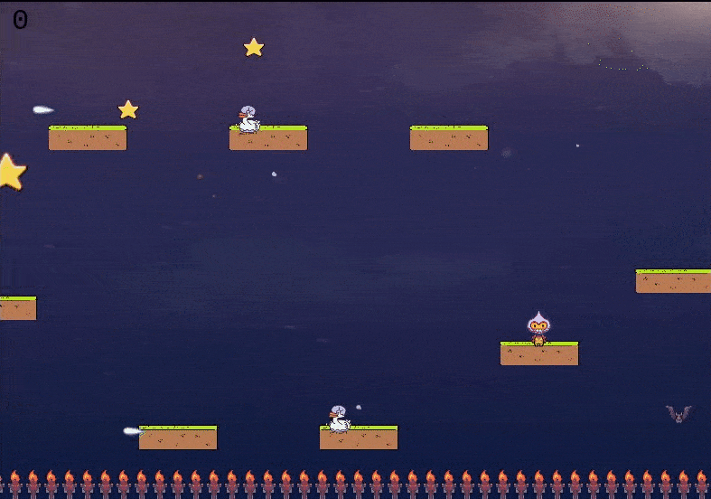
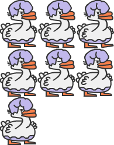

# RPG-game: Sky Mario

This is a Javascript Capstone project from the Microverse Javascript curriculum. The project is building a web Game app using the Phaser Game engine. The concept of inheritance is widely applied in this project, as it is required to extend defined classes from Phaser classes. 

### Scenes 
A phaser Game template is adapted from example codes. The tempate has different scenes: 
- The BootScene
- The Credits Scene
- The Options Scene
- The Preloader Scene 
- The Title Scene

The main work of this project is to add to the GameScene, and other important classes.

- The GameScene
- The InputScene
- The ScoresScene 

All the Scene classes inherit Scene class properties of Phaser. 
The GameScene is the main Scene class that has or imports all the game-related logic. 

### GameObjects 
Another set of classes that are built in this project are Game Objects wrapped in the GameObjetcs folder.
- Bat classes: extends from Phaser physics sprite class
- Goose Class: extends from Phaser physics sprite class
- GooseLaser: extends from Phaser physics sprite class
- Platforms: returns a set of platform objects which are of Phaser physics sprite class with group property
- Player: extends from Phaser physics sprite class 
- Stars: returns a set of star objects which are of Phaser physics sprite class with group property 

### GameData
Another couple of files that set data to and get data from API are wrapped in the GameData folder. The set data function is invoked in the gameOver condition. 



## Description 
The game is a simple famous Mario-like character Role Play Game (RPG), named Sky Mario. The sky Mario character moves between two game world walls, by jumping from platform to platform and collects stars in his way, which adds score. 

### Sky Mario 
The sky Mario is a sprite object, with Phaser physics support. It is affected by gravity, collision, and overlap with other objects. It has animation properties with seven frames, three for the left move, three for the right move, and one for turn move, which is controlled by left, right, and up arrows in the keyboard.


### Platforms
Another entity in the game is platforms. There are physics arcade sprite objects which can interact with other objects like with sky Mario. There are two types of platforms, static and dynamic. The static platform doesn't move in any circumstance but when sky Mario collides with it, it makes its y velocity zero. 
The other platform group is the dynamic platforms with immovable property. This physics group has fixed velocity but will not be affected by any sort of collision or overlap. This dynamic platform group bounces on world boundaries. 


### The fire floor
The floor of the game world is a fire floor. If the player slipped over platforms and fall into the fire floor it dies. 


### Enemies 
The enemies of star Mario in this game are goose and bat. 
The goose walks on moving platforms and it also shoots laser in the horizontal direction. It has animation property with left and right moves on the moving platforms. It can kill star Mario with both overlap and with laser.
The bat is another object which has a fixed velocity and bounces on world bounds. It can kill sky Mario on the overlap.




### The stars
The stars are fixed objects in the game. When the sky Mario collects them (overlap), scores will be added to the player. There are two big stars at the left and right walls of the game world. And both are created alternatively. If sky Mario collects the right big star, another big star on the left wall and another set of small stars throughout will be created, eventually. 

## Game API
A game API with user-generated keys is used to send and receive data from a backend endpoint. 


## Game Instruction 
- The game is a simple RPG game. The player can move the sky Mario in the left, right, and up direction with keyboard arrow keys. 
- The player should keep sky Mario on the platforms, jumping from one to the other to reach the opposite wall of the game world, where a big Star is awaiting. This process repeats until sky Mario dies and the game is Over.
- The player should collect as many stars as possible on its way. The small stars add 10 scores while the large star adds 50.
- When the player collects the big star at one end, then another big star will be created on the opposite wall, so sky Mario needs to go back to the opposite wall again to achieve more score 
- The player should keep sky Mario away from enemies (goose, goose laser, and bat).

[Video Link](https://www.loom.com/share/84724bf0eb9649bdafd3518a81cc54c0)

## Live demo
[Netlify](https://nostalgic-gates-d3f1b5.netlify.app/) 

## Built With

- Javascript
- Phaser Game Engine
- Axios  
- Jest 
- Babel

## Getting Started
The usage of this program is simple. 

### Prerequisites

- Javascript 
- Webpack 
- Phaser  

## Setup

### running with a local server 
- Open terminal on your workspace with

- Clone the project input the next code:

```bash
git clone https://github.com/henatan99/RPG-game
```
- Navigate to the folder of the project
```bash
cd /RPG-game/
```
- Install dependencies 
```bash
npm install
```
- Build webpack 

```bash
npm run build
```

- run the app on the local server
```bash
npm run start
```

**For console test demonstrations below**
- Install Jest
```bash
npm install --save-dev jest
```
- Install Babel
```bash
npm i -D @babel/preset-env
```
- Run the tests
```bash
npm run test 
```
## Authors

👤 **Henok Mossissa**

- GitHub: [@henatan99](https://github.com/henatan99)
- Twitter: [@henatan99](https://twitter.com/henatan99)
- LinkedIn: [Henok Mossissa](https://www.linkedin.com/in/henok-mekonnen-2a251613/)

## :handshake: Contributing

Contributions, issues, and feature requests are welcome!

## Show your support

Give a :star:️ if you like this project!

## Acknowledgment 

- Phaser Game Engine contributors 

## :memo: License

This project is [MIT](./LICENSE) licensed.

